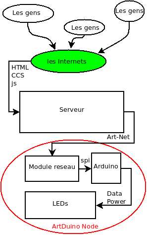

HaumTinsel
==========

La guirlande connectée du Haum
------------------------------

Une bande de LED adressables relier au reseau par le biais d'une connection ethernet et pilotable par une aplli web qui est accessible a tous

en un diagramme:

-------------------------

#### Quelques docs de travail et de debug
Dans Doc/

* capture.pcapng : une capure des trames envoyées par la lib python
* * la lib est lancée a la frame 13

* * la machine qui run la lib a l'adresse 192.168.5.124

* * 192.168.5.1 c'est un node OLA qui envoye regulierement des paquets ArtPoll

* * 192.168.5.171 c'est le node a base de ENC28J60 qui pilote les leds

* * 192.168.5.102 un autre node Arduino a base d'ethernet shield oficiel qui pilote une seule LED

* art-net.pdf la doc du protocol ArtNet.
